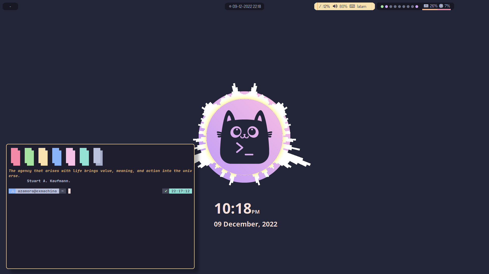

# NeonCat:
## LeftWM theme based on Catppuccin

Note that I'm using a double monitor setup with both HDMI and DisplayPort.
You can use the included script as is or comment out the relevant portion in the `up` script.

### Dependencies

- [Xrandr](https://xorg.freedesktop.org/)
- [Polybar](https://github.com/polybar/polybar)
- [Conky](https://github.com/brndnmtthws/conky)
- [Alacritty](https://github.com/alacritty/alacritty)
- [Feh](https://feh.finalrewind.org/)
- [Zellij](https://zellij.dev/)

#### Fonts

- [Nerd Fonts](https://www.nerdfonts.com/)
- [Font Awesome](https://fontawesome.com/)

#### Not included but highly recommended

- Fish Prompt: [fishblocks](https://github.com/manilarome/fishblocks)

Based on Catppuccin Mocha colorscheme.

The Alacritty config replaces any present config in a non-destructive way.

Rofi configuration is just [Catppuccin Mocha config](https://github.com/catppuccin/rofi).

